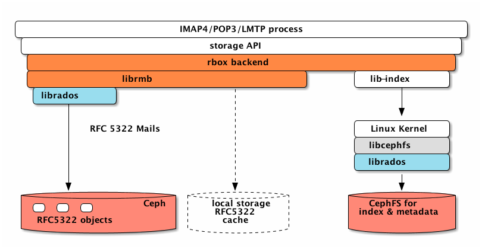

Dovecot RADOS Plugins
=====================

The goal of this project is the creation of a storage plugin for Dovecot, which enables the storage of emails in Ceph RADOS objects. The focus is currently on a hybrid model where the emails are stored in RADOS objects, while all other metadata (lists, index, cache) are stored in a file system that is located locally on the Dovecot server or on shared CephFS volumes. The latter allows the operation of Dovecot completely on Ceph.

As a bonus, a dictionary plugin is included, which allows the storage of Dovecot dictionaries in Ceph OMAPs.

## RADOS Storage Plugin
### The Hybrid Storage Model

The mails are saved directly as RADOS objects. All other data are stored as before in the file system. This applies in particular to the data of the lib-index of Dovecot. We assume the file system is designed as shared storage based on CephFS.

Based on the code of the Dovecot storage format [Cydir](http://wiki.dovecot.org/MailboxFormat/Cydir) we developed a hybrid storage as Dovecot plugin. The hybrid storage directly uses the librados for storing mails in Ceph objects. The mail objects are immutable and get stored in one RADOS object.  Immutable metadata is stored in omap KV and xattr. The index data is completely managed by Dvovecot's lib-index and ends up in CephFS volumes.


Because of the way MUAs access mails, it may be necessary to provide a local cache for mails objects. The cache can be located in the main memory or on local (SSD) storage. However, this optimization is optional and will be implemented only if necessary.



The mail objects and CephFS should be placed in different RADOS pools. The mail objects are immutable and require a lot of storage. They would benefit a lot from [erasure coded pools](http://docs.ceph.com/docs/master/architecture/#erasure-coding). The index data required a lot of writing and are placed on an SSD based CephFS pool.

### Mail Object Format

A mail is immutable regarding its RFC5322 content and some attributes know at the time of saving. The RFC5322 content is written as RADOS object data without any modifications. The immutable attributes Dovecot is using, are stored as RADOS xattr. Their values are stored in string representation. Right now, the following attributes are stored with the objects

* rbox format version = "I", currently "0.1"
* GUID = "G", UUID as hex string
* Received Date = "R", long stored as string
* Save Date= "S", long stored as string
* POP3 UIDL = "P", string
* POP3 Order = "O", unsigned int stored as string
* Mailbox GUID = "M", Mailbox Guid as hex string
* Physical Size = "Z", mails physical size
* Virtual Size = "V", mails's virtual size
* Mail UID = "U", uint32_t mail uid

All writable attributes like flags or keywords are stored in Dovecot index files only. 

The mail objects are addressed using a UUID in hex as OID for each mail. This OID is stored in the Dovecot index data as an extension record. The extension record is compatible to the obox format and can be inspected using `doveadm dump <path-to-mailbox>`: 
````
RECORD: seq=1, uid=568, flags=0x19 (Seen Answered Draft)
 - ext 0 keywords  :            (1000)
 - ext 1 modseq    :       4056 (d80f000000000000)
 - ext 4 cache     :        692 (b4020000)
 - ext 5 obox      :            (8eed840764b05359f12718004d2485ee8ded840764b05359f12718004d2485ee)
                   : guid = 8eed840764b05359f12718004d2485ee
                   : oid  = 8ded840764b05359f12718004d2485ee
 - ext 6 vsize     :       2214 (a6080000)
                   : vsize         = 2765958940838
                   : highest_uid   = 121556224
                   : message_count = 1404118538
````

If the index data for a mailbox gets lost, there is currently no way to reconstruct the mailbox from the RADOS objects. We want to use a RADOS namespace per user to make object iteration for a recovery possible.

### Configuration

To load the plugin, add _storage_rbox_ to the list of mail plugins. The name of the mailbox format is `rbox`. 
Add the plugin to `10-mail.conf` as _mail_location_. See [Mail location](http://wiki.dovecot.org/MailLocation) for details. 
All Dovecot placeholders for _mail_location_ can be applied.

The RADOS pool to use for the mail objects defaults to _mail_storage_. 
If the pool is missing, it will be created. 
The default pool name can be overridden with the plugin configuration entry _rbox_pool_name_.

Add for example to dovecot.conf:

    mail_location = rbox:/home/user/dovecot/var/mail/rados/%u

    mail_plugins = $mail_plugins storage_rbox
    plugin {
      rbox_pool_name = mail_storage
    }

See also [Common Configuration](#common-configuration) for more information.

#### shared/public folder

To configure shared folder access the acl plugin needs to be activated in the dovecot configuration as usual.
In the namespace configuration you need to use 'rbox' format as mailbox format. The configuration follows the mdbox configuration so rbox:%%h as location is sufficient.  
Dovecot-ceph plugin uses the username as Ceph namespace. In case of public folder no namepsace is set.

## Testing

We use [ImapTest](https://imapwiki.org/ImapTest) for testing the plugin. The Ceph cluster we used for the first tests runs locally and has been created using _vstart.sh_ (See [ceph/README.md](https://github.com/ceph/ceph/blob/master/README.md)). We test the protocols IMAP and POP3. Before you can start the tests you have to fit the environment.

For librmb we use [googletest](https://github.com/google/googletest) C++ Framework. Googletest library is added as git submodule you can clone googletest with: git submodule update --init --recursive
 
The configuration assumes a Ceph cluster running locally without _cephx_, that has for example been created using _vstart.sh_ as decribed in [Developer Guide (quick)](http://docs.ceph.com/docs/master/dev/quick_guide/) or [ceph/README.md](https://github.com/ceph/ceph/blob/master/README.md). 

    ../src/vstart.sh -X -n -l 

### Common
Create 100 user:
Name = t1 .. t100, Password = t

etc/passwd:

````
t1:{PLAIN}t::::::
t2:{PLAIN}t::::::
t3:{PLAIN}t::::::
...
t100:{PLAIN}t::::::
````

Script to create the users:

````
#!/bin/bash
for i in {1..100}
    do 
         echo "t$i:{PLAIN}t::::::" >> passwd
    done
````

### IMAP
It is not ncecessary to add or modify test profiles.
imap test can be started with the following command.

imaptest user=t%d pass=t port=10143

### POP3
If POP3 is used for the ImapTest, it is necessary to add or modify some configuration entries.

#### System

````
ulimit -n 3072
ulimit -s unlimited

````

#### Dovecot / LMTP
Enable POP3 and LMTP via etc/dovecot/dovecot.conf:

````
protocols = imap pop3 lmtp
````

Add or change the following entry of etc/dovecot/conf.d/10-master.conf:

````
default_process_limit = 500
default_client_limit = 3000

service lmtp {
  unix_listener lmtp {
    #mode = 0666
  }

  inet_listener lmtp {
    address = 127.0.0.1 ::1
    port = 10024
  }
}
````

#### ImapTest
To run ImapTest with POP3 you have to use a profile file which sets POP3 as the client protocol. [Profile example](https://github.com/tallence/dovecot-ceph-plugin/blob/master/doc/profile-pop3.conf)

## RADOS Dictionary Plugin

The Dovecot dictionaries are a good candidate to be implemented using the Ceph omap key/value store. They are a building block to enable a Dovecot, which runs exclusively on Ceph.

Dovecot uses two namespaces for dictionary K/V.

* `shared/<key>`: These are shared entries. These keys will be stored in a RADOS object named _<oid>/shared_. <key> will be used as omap key as given.
* `priv/<key>`: These are private entries for a user. These keys will be stored in a RADOS object named _<oid>/<username>_. <key> will be used as omap key as given.

### Configuration

To load the plugin, add _dict_rados_ to the list of mail plugins. 
The name of the dict driver is `rados`. 
Add the plugin for example to `10-mail.conf` as _mail\_attribute\_dict_. 
See [Dovecot Dictionaries](http://wiki.dovecot.org/Dictionary) for details.  

    mail_attribute_dict = rados:oid=metadata:pool=mail_dictionary
    mail_plugins = $mail_plugins dict_rados

The configuration parameters are:
* **oid**: The RADOS object id to use. 
* **pool**: The RADOS pool to use for the dictionary objects. The pool name ist optional and defaults to _mail_dictionary_. If the pool is missing, it will be created.

All key/values are be stored in OMAP key/values of the object <oid>.

See also [Common Configuration](#common-configuration) for more information.

### Testing

The source directory src/dict-rados contains a test application named test-*. They use the configuration in the same directory. 

The configuration assumes a Ceph cluster running locally without _cephx_, that has for example been created using _vstart.sh_ as decribed in [Developer Guide (quick)](http://docs.ceph.com/docs/master/dev/quick_guide/) or [ceph/README.md](https://github.com/ceph/ceph/blob/master/README.md). 

    ../src/vstart.sh -X -n -l 

Any other way to get a Ceph cluster is valid, too.

## Common Configuration

### Dovecot
To load the plugins, add _dict_rados_ or _storage_rbox_ to the list of mail plugins to load. 
There are several ways to do this. 
Add the plugin for example to `10-mail.conf` to _mail\_plugins_. 
See [Dovecot Configuration File](https://wiki.dovecot.org/ConfigFile?highlight=%28mail_plugins%29) for details.  

    mail_plugins = $mail_plugins storage_rbox dict_rados 
    
### Ceph
The plugin uses the default way for Ceph configuration described in [Step 2: Configuring a Cluster Handle](http://docs.ceph.com/docs/master/rados/api/librados-intro/#step-2-configuring-a-cluster-handle):

1. `rados_conf_parse_env()`: Evaluate the CEPH_ARGS environment variable.
2. `rados_conf_read_file()`: Search the default locations, and the first found is used. The locations are:
   * `$CEPH_CONF` (environment variable)
   * `/etc/ceph/ceph.conf`
   * `~/.ceph/config`
   * `ceph.conf` (in the current working directory)
   
   
## Compile and install the Plugins

To compile the plugin you need a configured or installed dovecot.

### Standard installation in /usr/local

    ./autogen.sh
    ./configure
    make
    sudo make install

### User installation in ~/dovecot

    ./autogen.sh
    ./configure --prefix=/home/user/dovecot   
    make install

### Configured source tree in ~/workspace/core

    ./autogen.sh   
    ./configure --with-dovecot=/home/user/workspace/core 
    make install

## Thanks

<table border="0">
  <tr>
    <td>
    <td>The development of this software is sponsored by Deutsche Telekom. We would like to take this opportunity to thank Deutsche Telekom.</td>
  </tr>
  <tr>
    <td>
    <td>This plugin borrows heavily from <a href="https://github.com/dovecot/core/">Dovecot</a> itself particularly for the automatic detection of dovecont-config (see m4/dovecot.m4). The lib-dict and lib-storage were also used as reference material for understanding the Dovecot dictionary and storage API.</td>
  </tr>
</table>
